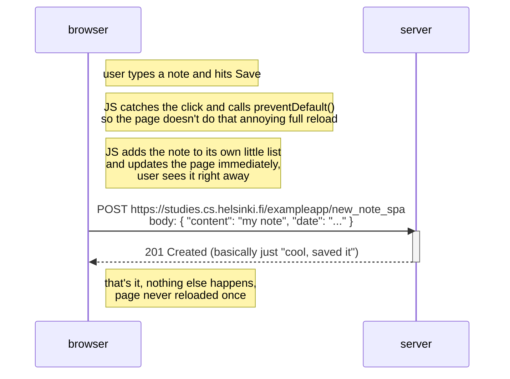

```mermaid
sequenceDiagram
    participant browser
    participant server

    Note right of browser: user types a note and hits Save

    Note right of browser: JS catches the click and calls preventDefault()<br/>so the page doesn't do that annoying full reload

    Note right of browser: JS adds the note to its own little list<br/>and updates the page immediately,<br/>user sees it right away

    browser->>server: POST https://studies.cs.helsinki.fi/exampleapp/new_note_spa<br/>body: { "content": "my note", "date": "..." }
    activate server
    server-->>browser: 201 Created (basically just "cool, saved it")
    deactivate server

    Note right of browser: that's it, nothing else happens,<br/>page never reloaded once
```
`